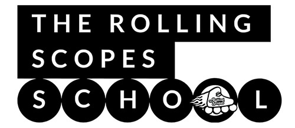

## Описание stage1

Stage1 - первый этап обучения в Rolling Scopes School. На этот этап принимают всех желающих вне зависимости от результатов выполнения заданий подготовительного этапа. 

## Цели первого этапа обучения
- Приобретение и совершенствование знаний и опыта работы с git, GitHub
- Совершенствование знаний и приобретение практического опыта семантичной валидной адаптивной вёрстки HTML/CSS3 
- Изучение теории JS Basics, её применение для решения задач и создания приложений
- Подготовка к прохождению [собеседования с ментором](https://docs.rs.school/#/technical-screening)

## Особенности stage1
Бесплатность, открытость, доступность, отсутствие вступительных испытаний, хорошая репутация курса привлекают большое количество студентов. В 2020 году на два потока курса зарегистрировались почти десять тысяч человек. К высокой конкуренции нужно быть готовыми, как и к тому, что по мере возрастания сложности заданий большинство зарегистрировавшихся на курс студентов его покинет. Самый большой отток студентов происходит на первом этапе. По результатам 2020 года почти треть из тех, кто зарегистрировался на курс, не выполнили ни одного задания, не прошли ни одного теста. До первого интервью с ментором дошли примерно полторы тысячи человек. Прохождение интервью и получение ментора завершает stage1 и одновременно резко повышает шансы студента успешно закончить курс: в 2020 году 1200 студентов учились с ментором, почти 900 студентов прошли курс полностью и получили сертификаты.

## О сложности курса
Оценив уровень [финальных проектов курса](https://docs.google.com/spreadsheets/d/1STe2AtPckojasiQI_j6s0cLRWEjvHG0LCSxN3yv5dBA/edit#gid=0) и приняв во внимание, что большинство студентов до поступления на курс не имели никакого опыта программирования, можно увидеть огромный прогресс за совсем небольшой промежуток времени. Путь между первой строкой кода и большим сложным функциональным проектом для многих студентов занял лишь чуть более пяти месяцев. Такой результат стал возможным благодаря упорной, напряженной, ежедневной работе, большому количеству затраченного времени и приложенных усилий. Учебная нагрузка курса составляет от 20 до 40 часов в неделю и больше. Она зависит от вашего образования, способностей, уровня подготовки, от того, занимались ли вы перед поступлением на курс самостоятельно.

## Структура stage1
Первые две недели stage1 посвящены изучению теоретических материалов, выполнению заданий и прохождению тестов stage0:
- [материалы](stage0/materials/index.md)
- [тесты](stage0/tests/index.md)
- [задания](stage0/tasks/index.md)  

Выполнив перечисленные задания можно будет приступить к изучению теоретических материалов выполнению тасков и тестов stage1, подготовке к собеседованию:
- [материалы](stage1/materials/index.md)
- [задания и тесты](stage1/tasks/index.md)
- [темы интервью](https://docs.rs.school/#/technical-screening?id=Темы-интервью)

## Полезные советы
- вся наиболее важная и актуальная информация курса размещается на сервере школы в [discord](https://discord.gg/zUr7wWYPXE) в канале с анонсами. Для набора 2021q1 это канал announcements-2021q1. Канал с анонсами необходимо просматривать каждый день. Будет полезно подписаться на телеграмм-канал с анонсами курса [https://t.me/rss_announcements](https://t.me/rss_announcements)
- [Расписание занятий и список заданий](https://docs.google.com/spreadsheets/d/1oM2O8DtjC0HodB3j7hcIResaWBw8P18tXkOl1ymelvE/edit#gid=0). В google docs размещается актуальная версия расписания. Расписание в [rs app](https://app.rs.school/) находится в альфа-версии и является менее точным.
- Документация курса https://docs.rs.school/
- Регистрация на курс https://app.rs.school/registry/student
- Проверьте, записаны ли вы на курс: https://app.rs.school/course/score?course=js-fe-2021Q1
- В rs app есть поиск. Удобнее всего искать пользователя по GitHub
- Все лекции и вебинары по возможности записываются. Записи лекций и вебинаров можно найти на [YouTube канале курса](https://youtube.com/c/rollingscopesschool). Большинство лекций сгруппировано по плейлистам, например, [JavaScript](https://www.youtube.com/playlist?list=PLzLiprpVuH8dBpVvTEqiXve3N0Efat9Z7). Видео лучше смотреть на скорости 1.25 или 1.5.
- оставляя [Feedback о школе](https://docs.google.com/spreadsheets/d/1IACz3tcZTx71Qh9z6ZXu8VimgISJvrO-bJUBLpQ-bVM/edit#gid=0) студенты набора 2020q3 в том числе ответили на вопрос "Что вы можете посоветовать студентам следующего набора?", в котором поделились своим опытом прохождения курса. Воспользуйтесь их советами

## Материалы
- [Профориентация 2020-Q3](https://youtu.be/pQ0hr5U8RL0)
- [Как учиться в rs app](https://youtu.be/v_69DaeZ7dM)
- [RSSchool для гуманитария](https://youtu.be/mCnOni_mqdk)
- [2020q3 Feedback о школе](https://docs.google.com/spreadsheets/d/1IACz3tcZTx71Qh9z6ZXu8VimgISJvrO-bJUBLpQ-bVM/edit#gid=0)
- [2020q3 лучшие финальные проекты](https://docs.google.com/spreadsheets/d/1STe2AtPckojasiQI_j6s0cLRWEjvHG0LCSxN3yv5dBA/edit#gid=0)
- [Расписание курса](https://docs.google.com/spreadsheets/d/1oM2O8DtjC0HodB3j7hcIResaWBw8P18tXkOl1ymelvE/htmlview#)
- [rs app - учебная платформа курса](https://app.rs.school/)
- [YouTube канал курса](https://www.youtube.com/channel/UCUgmHbk1rTFaf4GGKQ1OXfQ)