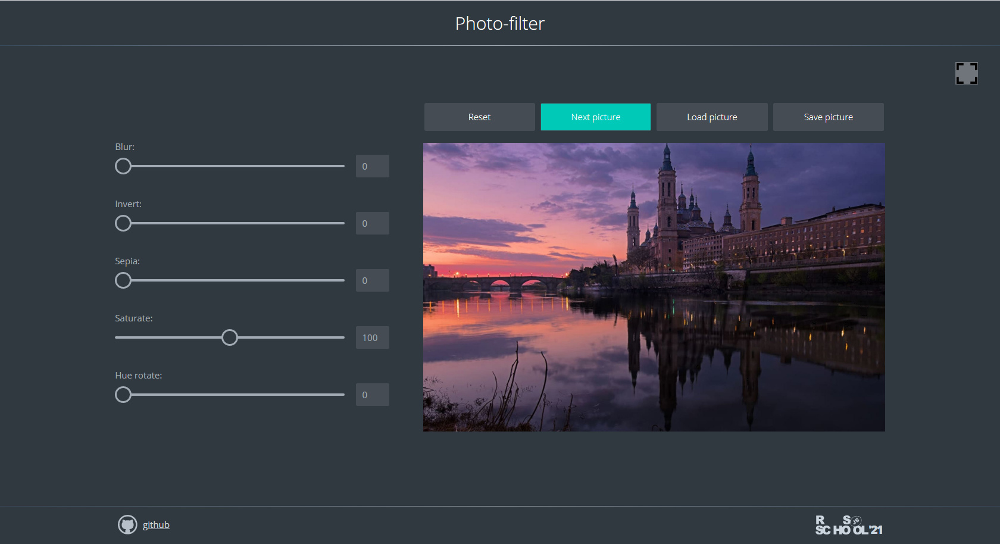

# photo-filter

| Дата выдачи | Deadline | Folder name  | Branch name  |
| ----------- | -------- | ------------ | ------------ |
|             |          | photo-filter | photo-filter |

Даты выдачи и дедлайны тасков находятся в [расписании](https://docs.google.com/spreadsheets/d/1oM2O8DtjC0HodB3j7hcIResaWBw8P18tXkOl1ymelvE/edit#gid=1646898206)

## Task 2. photo-filter

- [Демо](https://rolling-scopes-school.github.io/stage1-tasks/photo-filter/)
- [Файлы проекта](https://github.com/rolling-scopes-school/stage1-tasks/tree/photo-filter)
- [Советы по написанию кода](stage1/tasks/js-projects/photo-filter-hints.md)
- [Описание js-projects](stage1/tasks/js-projects/js-projects.md): требования к репозиторию, требования к оформлению приложения, технические требования etc

В ходе выполнения задания вам необходимо создать приложение позволяющее добавить изображению css-фильтры и сохранить изображение с наложенными на него фильтрами. Изображение в приложение можно загрузить с компьютера или по url.

## Структура и работа приложения

- на странице отображается изображение и настройки css-фильтров `blur`, `invert`, `saturate`, `sepia`, `hue rotate` в виде ползунков, каждому из которых соответствует определённый css-фильтр. Дополнительные фильтры можно добавить по своему усмотрению
- над изображением есть четыре кнопки, каждой из которых соответствует определённый функционал:
  - кнопка `Reset` позволяет сбросить настройки css-фильтров
  - кнопка `Next picture` предназначена для смены изображений, которые загружаются с внешнего ресурса по ссылке
  - кнопка `Load picture` для загрузки изображения с компьютера
  - кнопка `Save picture` позволяет скачать изображение вместе с добавленными фильтрами на компьютер

## Функциональность приложения

- напротив каждого ползунка есть поле, в котором отображается значение соответствующего css-фильтра. При перемещении ползунка значение изменяется
- при перемещении ползунка меняется внешний вид изображения на странице приложения в соответствии с изменением значения соответствующего css-фильтра
- при клике по кнопке `Reset`, сбрасываются значения всех css-фильтров. При этом возвращаются к исходному состоянию положение ползунков, значения в соответствующих им полях и внешний вид изображения
- при нажатии на кнопку `Next picture` загружается следующая картинка из [папки с картинками](https://github.com/rolling-scopes-school/stage1-tasks/tree/assets/images), расположенной на Github.  
  Ссылка на картинку формируется с учётом времени суток и номера картинки. Например: `https://raw.githubusercontent.com/rolling-scopes-school/stage1-tasks/assets/images/evening/18.jpg`  
  Здесь:
  - `evening` - время суток, другие значения `day`, `morning`, `night`
  - `18` - номер картинки, от `01` до `20`.
- после последнего изображения загружается первое
- картинки должны соответствовать текущему времнени суток:
  - с 6:00 до 11:59 - morning
  - с 12:00 до 17:59 - day
  - с 18:00 до 23:59 - evening
  - с 00:00 до 5:59 - night
- при клике по кнопке `Load picture` открывается окно выбора файлов на компьютере, выбранное изображение отображается в приложении, вписывается в предназначенное для него окно. Пропорции изображения при этом не искажаются.
- при клике по `Save picture` изображение скачивается на компьютер в исходном размере вместе с добавленными фильтрами. Внешний вид скачанного изображения совпадает с внешним видом изображения, которое редактировалось на странице приложения. Особое внимание обратите на фильтр `blur`. Изображение скачивается в формате `.png` с сохранением прозрачности, если она было в исходном изображении.
- есть кнопка `Fullscreen` при клике по которой можно развернуть приложение во весь экран. Повторный клик по кнопке `Fullscreen` или клик по клавише `Esc` клавиатуры выводит приложение из полноэкранного режима. В зависимости от того, находится приложение в обычном или полноэкранном режиме, меняется иконка на кнопке.  
  Взаимодействие кнопки `Fullscreen` с клавишей `F11` не требуется и не проверяется.

## Критерии оценки

**Максимальный балл за задание +60**

- на странице отображается изображение и настройки css-фильтров `blur`, `invert`, `saturate`, `sepia`, `hue rotate` в виде ползунков. Напротив каждого ползунка есть поле, в котором отображается значение соответствующего css-фильтра +5
- при перемещении ползунка в поле напротив него изменяется значение css-фильтра +5
- при перемещении ползунка меняется внешний вид изображения в соответствии с изменением значения соответствующего css-фильтра +5
- при клике по кнопке `Reset`, сбрасываются значения всех css-фильтров. При этом возвращаются к исходному состоянию положение ползунков, значения в соответствующих им полях и внешний вид изображения +5
- при нажатии на кнопку `Next picture` загружается следующее изображение из папки с картинками, расположенной на Github +5
- изображения перелистываются по кругу, после последнего изображения загружается первое +5
- изображения должны соответствовать текущему времнени суток +5
- при клике по кнопке `Load picture` открывается окно выбора файлов на компьютере, выбранное изображение отображается в приложении, вписывается в предназначенное для него окно. Пропорции изображения при этом не искажаются +5
- при клике по `Save picture` изображение скачивается на компьютер +5
- изображение скачивается в исходном размере в формате `.png` с сохранением прозрачности +5
- изображение скачивается с применёнными фильтрами. Внешний вид скачанного изображения совпадает с внешним видом изображения, которое редактировалось на странице приложения +5
- реализована функциональность кнопки `Fullscreen`, которая позволяет развернуть приложение во весь экран, выйти из полноэкранного режима, в полноэкранном режиме взаимодействует с клавишей `Esc` клавиатуры +5

**Штрафные баллы**

- обоснованные подозрение на списывание (js-код работы полностью повторяет код источника в интернете), работы с минимизированным или обфусцированным js-кодом, работы с использованием jQuery или других js-библиотек, работы с крайне низким качеством оформления - 0 баллов за кросс-чек. Ссылки на такие работы необходимо отправить модератору курса.

## Ключевые навыки

- использование js для работы с файлами
- загрузка локальных файлов в приложение
- сохранения файлов на компьютер
- работа с датами в js
- работа с Canvas API

## Материалы:

### Теория

- [input](https://developer.mozilla.org/ru/docs/Web/HTML/Element/Input)
- [input type="range"](https://developer.mozilla.org/ru/docs/Web/HTML/Element/Input/range)
- [output](https://developer.mozilla.org/ru/docs/Web/HTML/Element/output)
- [События: change, input](https://learn.javascript.ru/events-change-input)
- [Element.matches()](https://developer.mozilla.org/ru/docs/Web/API/Element/matches)
- [CSS Filters](https://css-tricks.com/almanac/properties/f/filter/)
- [CSS Filters for Online Photo Editing](https://orangeable.com/css/filters)
- [Использование переменных в CSS](https://developer.mozilla.org/ru/docs/Web/CSS/Using_CSS_custom_properties)
- [Изучите CSS-переменные за 5 минут](https://medium.com/devschacht/изучите-css-переменные-за-5-минут-3a5dc6193857)
- [Дата и Время в js](https://learn.javascript.ru/datetime)

### Видео

- [JS30. CSS Variables](https://youtu.be/AHLNzv13c2I)

### Демо для вдохновения

- [Магия фильтров: 9 интересных приложений для обработки фото](https://asn24.ru/sova/community/magiya-filtrov-9-interesnykh-prilozheniy-dlya-obrabotki-foto-v-instagram/)
- [CSSFilterGenerator](https://www.cssfiltergenerator.com/)

[Документ для вопросов](https://docs.google.com/spreadsheets/d/1dMDLBC4-1XPaVMehZB6DqetToXZhq4x0PiZtj-jvLRc/edit#gid=487334651)

## Cross-check

- инструкция по проведению cross-check: https://docs.rs.school/#/cross-check-flow
- ссылки на лучшие работы с дополнительным функционалом либо авторским качественным оформлением добавьте, пожалуйста, в эту форму [https://forms.gle/QELfqGDNCaPLHMzo9](https://docs.google.com/forms/d/e/1FAIpQLSc7DQoF0U4lB2qdMceofIl1F59UFS-pQAfQfJwcAc4nIXn31g/viewform?usp=sf_link)
