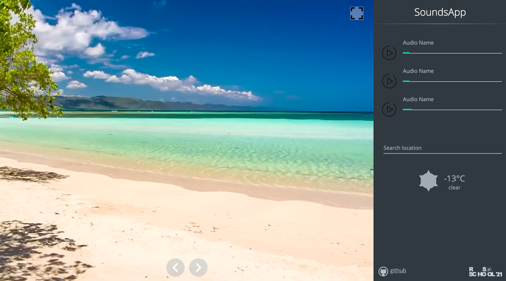

# sounds-app

### Предварительная версия задания в которую могут вноситься правки. Окончательная версия будет доступна после выдачи задания

| Дата выдачи | Deadline         | Folder name   | Branch name   |
| ------------| ---------------- | ------------- | ------------- |
|             |                  | sounds-app    | sounds-app    |

Даты выдачи и дедлайны тасков находятся в [расписании](https://docs.google.com/spreadsheets/d/1oM2O8DtjC0HodB3j7hcIResaWBw8P18tXkOl1ymelvE/edit#gid=1646898206)

## Task 3. sounds-app

- [Демо](https://7oom.ru/penie-ptic.html)
- [Файлы проекта](https://github.com/rolling-scopes-school/stage1-tasks/tree/sounds-app)
- [Советы по написанию кода](stage1/tasks/sounds-app-hints.md)
- [Описание js-projects](stage1/tasks/js-projects.md): требования к репозиторию, требования к оформлению приложения, технические требования etc

В ходе выполнения задания вам необходимо создать музыкальное приложение, в котором есть несколько звуковых тем. Приложение состоит из слайдера, слайды которого содержат зацикленное видео, и боковой панели, которая содержит несколько аудиоплееров со звуками природы и музыкой и виджет с прогнозом погоды. 

## Структура и работа приложения
- в приложении есть не меньше шести звуковых тем. Каждая тема включает слайд слайдера с зацикленным видео, а также несколько аудио плееров (минимум два для каждой темы) с звуками природы и музыкой, которые соответствуют видео
- темы можно перелистывать кликами по стрелкам слайдера. При этом слайды с видео пролистываются с эффектом сдвига слайда в сторону, в аудиоплеерах, которые размещаются в боковой панели, меняется содержимое (названия аудиотреков и ссылки на аудио) 
-  в боковой панели есть виджет погоды, отображающий погоду для указанного пользователем населённого пункта. Виджет содержит иконку погоды, температуру, описание погоды и ещё минимум два других показателя погоды из тех, которые возвращает API

## Функциональность приложения
- темы можно перелистывать свайпами мышкой по слайдеру с видео. Перелистывание тем при помощи тачскрина не проверяется и не оценивается
- темы пролистываются зацикленно, после последней снова идёт первая
- кастомный аудиоплеер, выглядящий так же, как в демо. Функционал плеера включает кнопку `Play/Pause` и регулятор громкости звука
- при открытии новой темы при перелистыванием слайдера (кликом по кнопке или свайпом) автоматически запускаются все относящиеся к ней аудиоплееры, есть возможность независимо настраивать громкость каждого из них
- последняя выбранная пользователем тема и указанный пользователем город, для которого отображается прогноз погоды, сохраняются при перезагрузке страницы
- есть кнопка `Fullscreen`.  
Обратите внимание, кнопка `Fullscreen` работает немного не так, как в других тасках серии:
  -  при клике по кнопке `Fullscreen` можно развернуть во весь экран слайд с видео, при этом боковая панель и сама кнопка `Fullscreen` скрывается
  - вывести приложение из полноэкранного режима можно кликом по клавише `Esc`, либо кликом по клавише `F11`. При этом кнопка `Fullscreen` снова отображается на экране.
- реализована адаптивность. Корректность отображения приложения проверяется для ширины экрана от 1920рх до 500рх включительно. На разрешениях меньше десктопного (768рх) можно скрыть только виджет погоды. Слайдер с видео, аудиоплееры, кнопка `Fullscreen` должны отображаться на экране при любом разрешении от 1920рх до 500рх включительно.
- оптимизация скорости работы приложения. Пункт не проверяется и не оценивается, но без него ваше приложение может оказаться полностью неработоспособным
- есть прелоадер, который отображается во время загрузки приложения 

## Технические требования
- запрещено использовать js-библиотеки для создания слайдера (дополнительное напоминание, так как это требование уже есть в [описании js-projects](stage1/tasks/js-projects.md))

## Критерии оценки
В критериях оценки приводится краткий перечень требований, полное описание находится в разделе [Функциональность приложения](#Функциональность-приложения). 

**Максимальный балл за задание +100**

- в приложении есть не меньше шести звуковых тем. Каждая тема включает слайд слайдера с зацикленным видео, а также несколько аудио плееров (минимум два для каждой темы) с звуками природы и музыкой, которые соответствуют видео +10
- темы можно перелистывать кликами по стрелкам слайдера. При этом слайды с видео пролистываются с эффектом сдвига слайда в сторону, в аудиоплеерах, которые размещаются в боковой панели, меняется содержимое (названия аудиотреков и ссылки на аудио) +10
- темы можно перелистывать свайпами мышкой по слайдеру с видео +5
- темы пролистываются зацикленно, после последней снова идёт первая +5
- кастомный аудиоплеер, выглядящий так же, как в демо. Функционал плеера включает кнопку `Play/Pause` и регулятор громкости звука +10
- при открытии новой темы перелистыванием слайдера (кликом по кнопке или свайпом) автоматически запускаются все относящиеся к ней аудиоплееры, есть возможность независимо настраивать громкость каждого из них +10
- последняя выбранная пользователем тема и указанный пользователем город, для которого отображается прогноз погоды, сохраняются при перезагрузке страницы +10
- есть кнопка `Fullscreen` при клике по которой можно развернуть во весь экран слайд с видео, при этом боковая панель и сама кнопка `Fullscreen` скрывается. Вывести приложение из полноэкранного режима можно кликом по клавише `Esc`, либо кликом по клавише `F11`. При этом кнопка `Fullscreen` снова отображается на экране +5
- реализована адаптивность. Корректность отображения приложения проверяется до ширины экрана 500рх включительно. На разрешениях меньше десктопного должны отображаться слайдер с видео, аудиоплееры, кнопка `Fullscreen`, можно скрыть только виджет погоды +10
- есть прелоадер, который отображается во время загрузки приложения +5

**Штрафные баллы**
- обоснованные подозрение на списывание (код работы полностью повторяет код источника в интернете), работы с минимизированным или обфусцированным js-кодом, работы с использованием jQuery, работы с крайне низким качеством оформления - 0 баллов за кросс-чек. Ссылки на такие работы необходимо отправить модератору курса

## Ключевые навыки
- работа с HTML5-видео
- создание зацикленного слайдера/свайпера
- кастомизация аудио
- получение данных от API
- работа с асинхронными запросами
- сохранение данных в local storage

## Материалы:
- [HTML5-видео](https://developer.mozilla.org/ru/docs/Web/HTML/Element/video)
- [HTML5-аудио](https://html5book.ru/html5-audio/)
#### LocalStorage
- [Window.localStorage](https://developer.mozilla.org/ru/docs/Web/API/Window/localStorage)
- [LocalStorage на пальцах](https://tproger.ru/articles/localstorage/)
#### Асинхронность, async/await
- [Поймут даже дети: простое объяснение async/await и промисов в JavaScript](https://habr.com/ru/post/474726/)
- [JavaScript. Как работает Async, Await](https://youtu.be/SHiUyM_fFME)
- [Вебинар: Асинхронность в JavaScript](https://youtu.be/Ih6Q7ka2eSQ)
#### Ресурсы: видео, аудио, API
- [Pixabay - free video](https://pixabay.com/videos/search/nature/)
- [Freesoundeffects](https://www.freesoundeffects.com/free-sounds/ambience-10005/)
- [Nature sound](https://www.zapsplat.com/sound-effect-category/nature/)
- [API погоды](https://openweathermap.org/)
#### Демо для вдохновения
- http://ecosounds.net/
- http://7oom.ru/penie-ptic.html
- http://www.allolo.ru/?id=12

[Документ для вопросов](https://docs.google.com/spreadsheets/d/1dMDLBC4-1XPaVMehZB6DqetToXZhq4x0PiZtj-jvLRc/edit#gid=610380603)

## Cross-check
- инструкция по проведению cross-check: https://docs.rs.school/#/cross-check-flow
- ссылки на лучшие работы, добавьте, пожалуйста, в эту форму [https://forms.gle/qzqvrDmWbhLerYzb7](https://docs.google.com/forms/d/e/1FAIpQLSdqWPAPY5lFefhHOzoC0ms2xXPOYr2qGMvAiN87pEmCkj55hw/viewform?usp=sf_link)