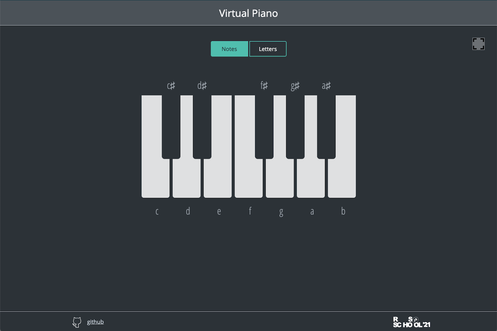

# virtual-piano

### Предварительная версия задания в которую могут вноситься правки. Окончательная версия будет доступна после выдачи задания

| Дата выдачи | Deadline         | Folder name   | Branch name   |
| ------------| ---------------- | ------------- | ------------- |
|             |                  | virtual-piano | virtual-piano |

Даты выдачи и дедлайны тасков находятся в [расписании](https://docs.google.com/spreadsheets/d/1oM2O8DtjC0HodB3j7hcIResaWBw8P18tXkOl1ymelvE/edit#gid=1646898206)

## Task 1. virtual-piano

[Демо](https://rolling-scopes-school.github.io/stage1-tasks/virtual-piano/)

[Файлы проекта](https://github.com/rolling-scopes-school/stage1-tasks/tree/virtual-piano/virtual-piano)

[Советы по написанию кода](stage1/tasks/virtual-piano-hints.md)

[Инструкция к stage1 js-projects](stage1/tasks/js-projects.md)

В ходе выполнения задания вам необходимо создать приложение - виртуальное пианино. 

## Структура приложения
- на странице отображаются клавиши пианино. Минимальное количество клавиш 12 - 7 белых и 5 черных (одна октава)
- возле клавиш пианино отображаются или названия соответствующих этим клавишам нот (над черными клавишами используется знак альтерации диез), или буквы клавиш клавиатуры, при клике по которым они звучат. Что именно отображается в данный момент зависит от состояния переключателя Notes/Letters
- есть иконка для перехода в полноэкранный режим
- в футере приложения отображается год создания, иконка гитхаба со ссылкой на гитхаб автора приложения, [логотип курса](https://rs.school/images/rs_school_js.svg) со [ссылкой на курс](https://rs.school/js/)

## Функциональность приложения
- при клике по клавише пианино мышкой проигрывается соответствующая этой клавише нота
- при клике по клавишам клавиатуры, которые соответствуют клавишам виртуального пианино, проигрываются ноты
- можно провести мышкой с зажатой левой кнопкой по клавишам пианино, при этом они будут нажиматься и звучать
- при клике по переключателю Notes/Letters сменяется отображение возле клавиш пианино названий соответствующих этим клавишам нот или букв
- активное и неактивное состояние клавиш пианино отличаются по стилю. В активное состояние клавиша пианино переходит 
  - при клике по ней мышкой
  - при клике по соответствующей клавише клавиатуры
  - если провести над клавишей мышкой с зажатой левой кнопкой
- активное и неактивное состояние кнопок переключателя отличаются по стилю
- есть кнопка Fullscreen при клике по которой можно развернуть приложение во весь экран. Повторный клик по кнопке выводит приложение из полноэкранного режима. В зависимости от того, находится приложение в обычном или полноэкранном режиме, меняется иконка на кнопке

## Критерии оценки

В критериях оценки приводится краткий перечень требований, полное описание находится в пунктах [Cтруктура приложения](#Структура-приложения) и [Функциональность приложения](#Функциональность-приложения). 

**Максимальный балл за задание +50**
- звуки проигрываются при кликах по клавишам пианино мышкой +10
- звуки проигрываются при кликах по клавишам клавиатуры, которые соответствуют клавишам пианино +10
- можно провести мышкой с зажатой левой кнопкой по клавишам пианино, при этом они будут нажиматься и звучать +10
- возможность переключения отображения возле клавиш пианино названий нот или букв клавиш клавиатуры, при клике по которым они звучат +5
- активное и неактивное состояние клавиш пианино отличается по стилю +5
- активное и неактивное состояние кнопок переключателя отличаются по стилю +5
- возможность развернуть приложение во весь экран +5

## Ключевые навыки
- работа с DOM
- работа со звуком

## Материалы:

### Теория
- [методы поиска элементов](https://learn.javascript.ru/searching-elements-dom)
- [события мыши](https://learn.javascript.ru/mouse-events-basics) 
- [события клавиатуры](https://learn.javascript.ru/keyboard-events)
- [делегирование событий](https://learn.javascript.ru/event-delegation)
- [data-атрибуты](https://learn.javascript.ru/dom-attributes-and-properties#nestandartnye-atributy-dataset)
- [шаблонные строки](https://developer.mozilla.org/ru/docs/Web/JavaScript/Reference/template_strings);
- [стили и классы](https://learn.javascript.ru/styles-and-classes)
- [Fullscreen API](https://developer.mozilla.org/ru/docs/DOM/Using_fullscreen_mode)
- [Using the Fullscreen API. Tutorial](https://www.digitalocean.com/community/tutorials/js-fullscreen-api)

### Видео
- [JS30. JavaScript Drum Kit](https://youtu.be/VuN8qwZoego)

### Демо для вдохновения
- [Демо 1](https://jliza.ru/assets/piano2/)
- [Демо 2](https://www.onlinepianist.com/virtual-piano)
- [Демо 3](https://virtualpiano.net/)

[Документ для вопросов](https://docs.google.com/spreadsheets/d/1dMDLBC4-1XPaVMehZB6DqetToXZhq4x0PiZtj-jvLRc/edit#gid=1972614983)

## Cross-check
- инструкция по проведению cross-check: https://docs.rs.school/#/cross-check-flow
- ссылки на лучшие работы, добавьте, пожалуйста, в эту форму [https://forms.gle/BFGAF88zZADwRkKV7](https://docs.google.com/forms/d/e/1FAIpQLSdg6dC0I2DS7R9qKIEHSoCBUBmj0HwTDLvXxOsv5_PMsB0oBQ/viewform?usp=sf_link)
