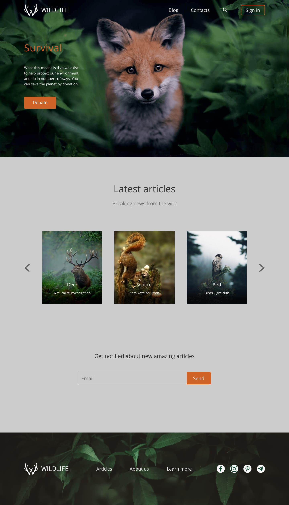

# wildlife

Задание: сверстать страницу согласно макету. 

**[Макет Wildlife](https://www.figma.com/file/dJoqHi1YHTLR06PPEeCc7t/Wildlife)**

После того как авторизуемся в Фигме и открываем проект, он будет отображаться во вкладке Recent. Чтобы его продублировать себе (и иметь права редактирования в своей копии) нужно нажать по проекту правой кнопкой и выбрать функцию Duplicate, после чего можно будет найти редактируемую копию проекта во вкладке Drafts — это позволит удобнее с проектом работать при верстке.

- Точное совпадение с макетом не требуется. Основное требование - визуальное сходство вёрстки и страницы макета. Допускается отклонение от макета на 5рх по горизонтали и 10рх по вертикали.
- Адаптивность не проверяется, но рекомендуется. Постарайтесь сделать сайт адаптивным, то есть подстраивающимся под размер экрана и отображающимся на небольших экранах без появления полосы прокрутки.
- Работающий слайдер не требуется, но если можете - сделайте.
- Если в строке несколько объектов визуально одинаковой ширины, то ширина содержащих их блоков должны быть одинаковой.
- «Интерактивный» означает, что у элемента появляется визуальный эффект или анимация при каких-либо действиях пользователя, например, при наведении курсора или нажатии. Обычно такой эффект реализуют при помощи следующих свойств:
  - `cursor: pointer`,
  - `background`,
  - `text-decoration: underline`,
  - `color`
- Ширина макета 1440px, ширина контентной части 1200рх. Макет позиционируем по центру с равными отступами по краям. Блокам задаём цвет фона, растягивая их во всю ширину экрана. Блоки Header и Survival - `background-color: #02160b`, блоки Latest articles и Get notified `background-color: #cccccc`, блок Footer - `background-color: #181617`.
- требования к вёрстке отдельных блоков указаны в критериях оценки.

## Требования к репозиторию

- Задание выполняется в вашем личном приватном репозитории
- Название репозитория - `wildlife`
- Разработка ведётся в главной ветке репозитория - `main` (или `master`)
- Для деплоя используйте `netlify`. Название страницы дайте по схеме: имя гитхаб аккаунта - название таска

## Требования к коммитам

- История коммитов должна отображать процесс разработки приложения. 
- [Названия коммитов дайте согласно гайдлайну](https://docs.rs.school/#/git-convention)

## Требования к Pull Request

- Название Pull Request дайте по названию задания
- [Описание Pull Request дайте по схеме](https://docs.rs.school/#/pull-request-review-process?id=Требования-к-pull-request-pr)

## Технические требования

- Вёрстка проверяется в браузере Google Chrome последней версии
- Запрещается использование CSS-фреймворков (bootstrap, foundation и т.д.)
- Допускается использование CSS препроцессоров, normalize.css

## Проверка задания

- Задание будут проверяться посредством кросс-чека. [Инструкция по проведению cross-check](https://docs.rs.school/#/cross-check-flow)

## Как сабмитить задание

До наступления дедлайна зайдите в rs app https://app.rs.school/, выберите **Cross-Check: Submit**, в выпадающем списке выберите `wildlife`, в поле **Solution URL** добавьте ссылку на задеплоенную версию созданного вами сайта, нажмите кнопку **Submit**.

Засабмитить задание необходимо как можно раньше, как только в rs app появится такая возможность. После сабмита задание можно продолжать выполнять до самого дедлайна.

## Критерии оценки 

**Максимальный балл за задание +50**

#### 1. Блок **Header** +10 
- Блок Header содержит только логотип и панель навигации
- Логотип содержит два элемента - svg-иконку и текст.
- На странице обязательно должен присутствовать один элемент `<h1>`. Расположите его на свое усмотрение.
- Панель навигации состоит из четырёх элементов: двух ссылок, иконки поиска и кнопки "Sign in" . Верстается в виде ненумерованного списка: `ul > li > a`
- Все элементы панели навигации должны быть интерактивными

#### 2. Блок **Survival** +10
- Расстояние между буквами заголовка регулируется css-свойством `letter-spacing`
- Разрывы строк в текстовом блоке регулируются шириной блока без использования тега ` `
- Кнопка Donate интерактивная. Используются указанные в макете стили для различных состояний кнопки
- У блоков Header и Survival общее фоновое изображение 

#### 3. Блок **Latest articles** +10
- Для вёрстки трёх изображений в ряд лучше использовать [flexbox](https://habr.com/ru/post/467049/) или [grid](https://tuhub.ru/posts/css-grid-complete-guide). Float использовать можно. `<table>` - нельзя!
- Надписи поверх изображений можно разместить при помощи абсолютного позиционирования. Менее семантически правильный, но более простой в реализации вариант - использовать для добавления изображений css-свойство `background-image`.
- Стрелки слайдера интерактивны.

#### 4. Блок **Get notified** +10
- Для отправки данных используется тег `<form>`
- Поля email и send верстаются тегами `<input>` с типом text и submit соответственно.
- Надпись 'email' это placeholder.

#### 5. Блок **Footer** +10
- Блок Footer содержит логотип, дополнительную панель навигации и ссылки на социальные сети
- Логотип полностью повторяет логотип блока Header
- Дополнительная панель навигации состоит и ссылки на социальные сети верстаются в виде ненумерованных списков: `ul > li > a`
- Иконки социальных сетей верстаются с использованием svg-файлов в качестве фоновых изображений
- Все ссылки в футере должны быть интерактивными

## Pixel Perfect. Штрафные баллы

- В первую очередь обращаем внимание на визуальное сходство созданного сайта и макета. 
- Проверку Pixel Perfect стоит проводить в разрешении экрана десктопа (окна операционный системы на мониторе) 100%.
- В браузере Google Chrome при помощи расширения [PerfectPixel](https://chrome.google.com/webstore/detail/perfectpixel-by-welldonec/dkaagdgjmgdmbnecmcefdhjekcoceebi) проверяем соответствие наложения импортированного из figma изображения макета на страницу сайта. 
- Ширины должны быть идентичны, и значение будет равно 1440px.
- Если визуальные отличия элементов или блоков составляют более 5px по горизонтали или более 10рх по вертикали, то ставим **-2** балла единовременно за каждый логический блок, в котором присутствует ошибка. Сами блоки при этом рассматриваются по раздельности, т.е. недочеты предыдущего блока не переносятся на следующий, а при переходе проверки на следующий блок, мы его выравниваем с наложенным изображением.
- Относительно текста проверяем размеры только по высоте. Ширину слов и отступ между буквами не учитываем при сопоставлении макета и вёрстки.
- Общее количество баллов за блок с учётом штрафных баллов не может быть ниже нуля.  
  

## Материалы
- [Старт в Figma для верстальщика](https://htmlacademy.ru/blog/useful/figma)
- [Вопросы и ответы по Figma](http://figmaweb.ru/faq-figma-otvety-na-samye-populyarnye-voprosy/)
- [Верстка сайта с нуля из Figma](https://www.youtube.com/playlist?list=PL5_s7xdj2Vsw-bCx5nOZJMFIiHwRgok--)
